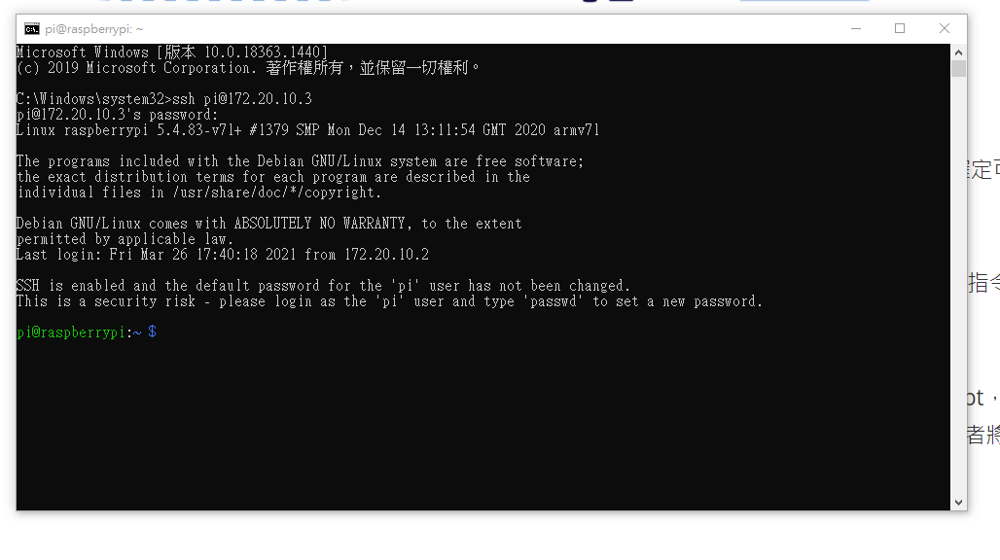
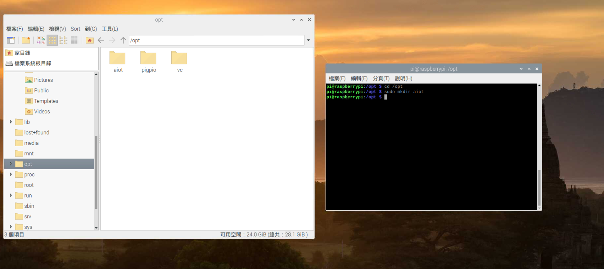
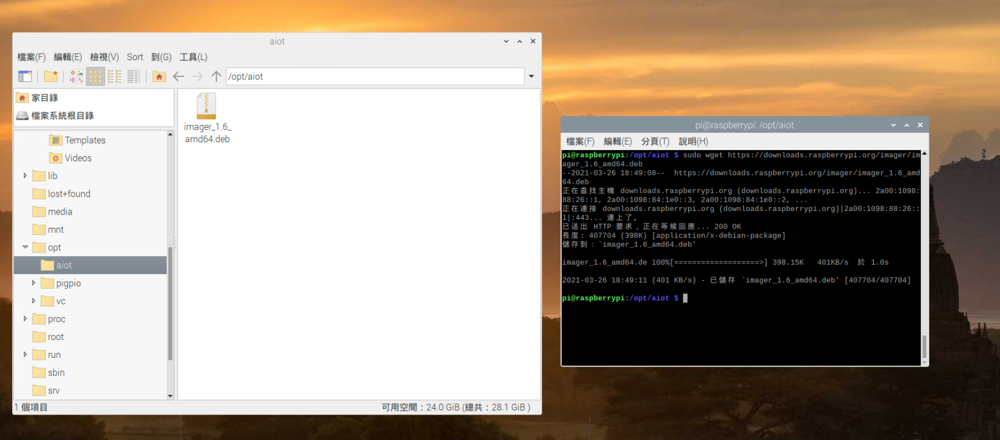
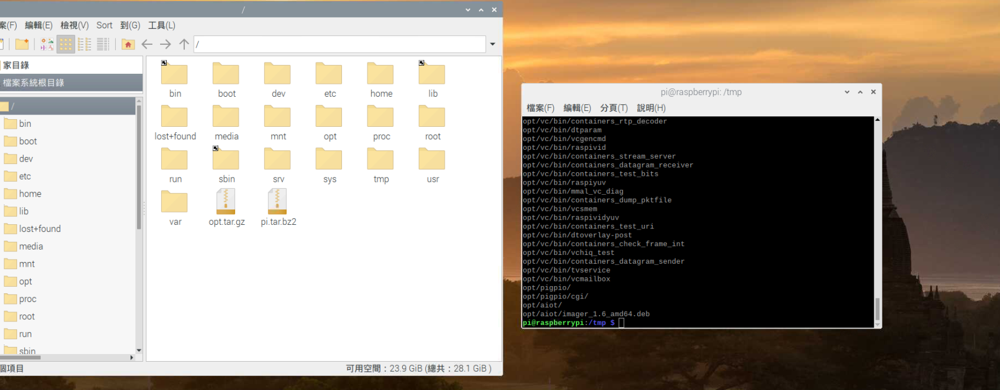
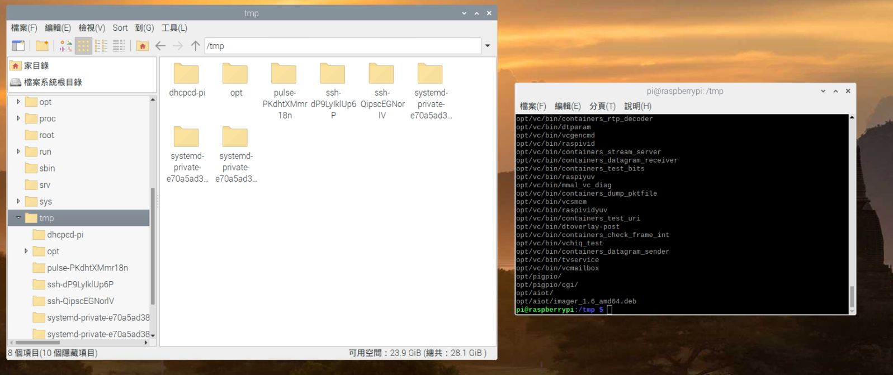

## 1. 使用 raspi-config 更改 root 的密碼，設定連線的無線基地台，開啟 ssh 伺服器，確定可以用遠端連線進入 pi。
---

## 2. 切換至 /opt 路徑，建立一個 /opt/aiot 子目錄，切換至 /opt/aiot 子目錄，用 wget 指令下載一個網路上的檔案，下載完成後用 ls –al 指令，確定下載的檔案存在。
---

    
## 3. 切換至/根目錄(指令: cd /)，壓縮 /opt 子目錄進行備份，使用 tar zcvf opt.tar.gz /opt，以及 bzip2 opt.tar.gz 壓縮成 bz2 格式，最後將 opt.tar.gz 用 tar zxvf opt.tar.gz 指令練習解壓，或者將 opt.tar.gz 解壓至 /tmp 之下，確定 /opt 子目錄有壓縮備份成功 。
---

