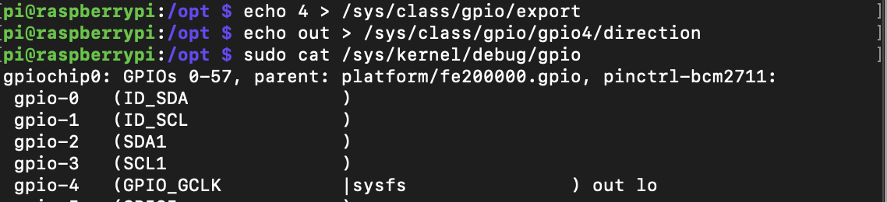

## 1.實際練習 /sys/class/gpio 啟動 gpio，設定 gpio 接腳的狀態，並且卸載所啟動的 gpio。同時觀察卸載之後的 gpio 接腳，繼續送設定狀態的資料，將會發生什麼樣的狀態。

* 練習 /sys/class/gpio 啟動 gpio
pi@raspberrypi:/ $ echo 4 > /sys/class/gpio/export
pi@raspberrypi:/ $ echo out > /sys/class/gpio/gpio4/direction
pi@raspberrypi:/ $ sudo cat /sys/kernel/debug/gpio

* 設定 gpio 接腳的狀態，並且卸載所啟動的 gpio。
echo 4 > /sys/class/gpio/unexport

* 觀察卸載之後的 gpio 接腳，繼續送設定狀態的資料，將會發生什麼樣的狀態。

## 2. 使用 raspi-config 啟動 i2c，觀察 gpio2 以及 gpio3 的變化，透過 /sys/kernel/debug/gpio 觀察改變的情形，嘗試重新做一次作業針對 gpio2 以及 gpio3 操作，觀察在 i2c 啟動的狀態下，gpio2 以及 gpio3 相對 gpio4 有何不同。

並無明顯差異。

## 3.使用 raspi-config 啟動 spi，觀察 gpio 各接腳的變化狀態，嘗試將 spi 關閉之後，透過 /sys/kernel/debug/gpio，觀察可以使用 gpio 數量的變化情形 。

spi開之前

spi 開之後

