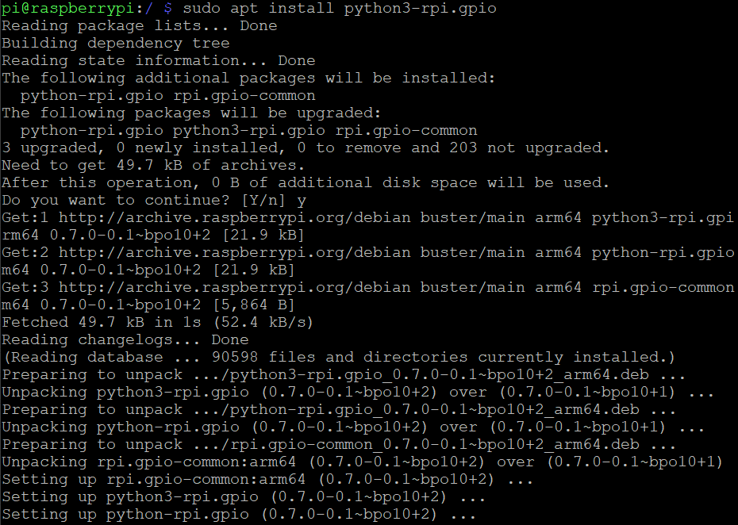
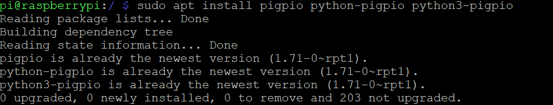
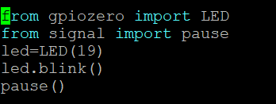
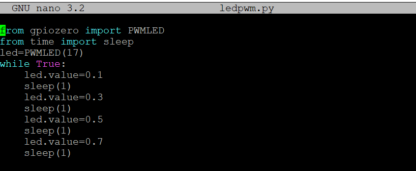
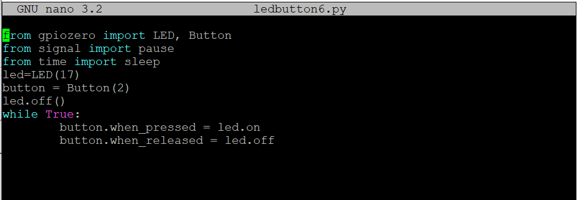
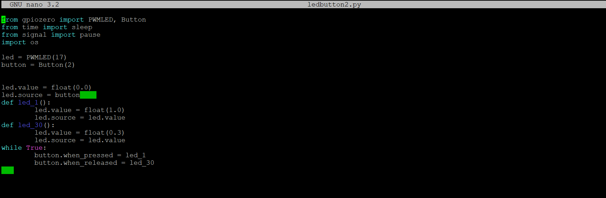

## 1. 實際安裝 gpiozero，先安裝 RPi.GPIO，再安裝 pigpio，觀察安裝過程系統顯示的訊息。比較直接啟動 raspi-config 的 interfacing 選項，透過啟動 Remote GPIO，直接安裝GPIOZero。
---

實際安裝 gpiozero,比較直接啟動 raspi-config 的 interfacing 選項，透過啟動 Remote GPIO，直接安裝GPIOZero。
* 實際安裝 gpiozero: Requirement already satisfied: gpiozero in /usr/lib/python3/dist-packages(1.5.1)
* 透過啟動 Remote GPIO透過啟動 Remote GPIO:Requirement already satisfied: gpiozero in /usr/lib/python3/dist-packages (1.5.1)

## 2. 實際練習 GPIOZero 控制 LED，確定單獨的 GPIO 控制 LED 亮跟暗交替閃爍完成，並且 PWM 控制 LED 明亮的完成後，嘗試依序改變led.value的值，分別設定 0.1, 0.3, 0.5, 0.7 觀察差異。
---

## 3. 實際練習 GPIOZero 透過 Button 控制 LED，在按鈕的過程中，觀察實際按下按鈕的次數，LED 點亮的次數，是否一致。練習修改程式，讓按鈕按下是全亮，按鈕放開後是 30% 的亮度。
---

