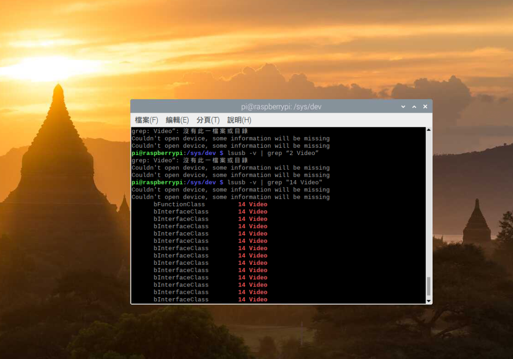
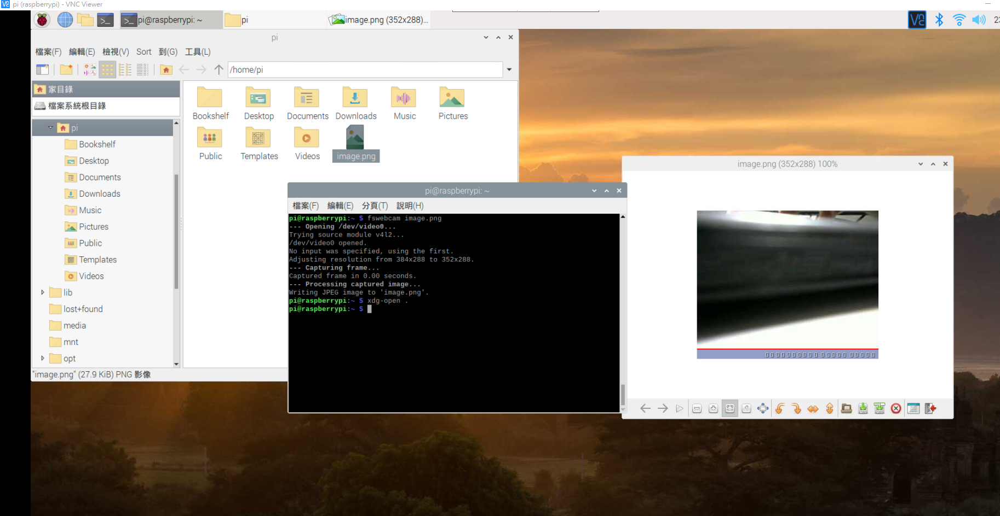
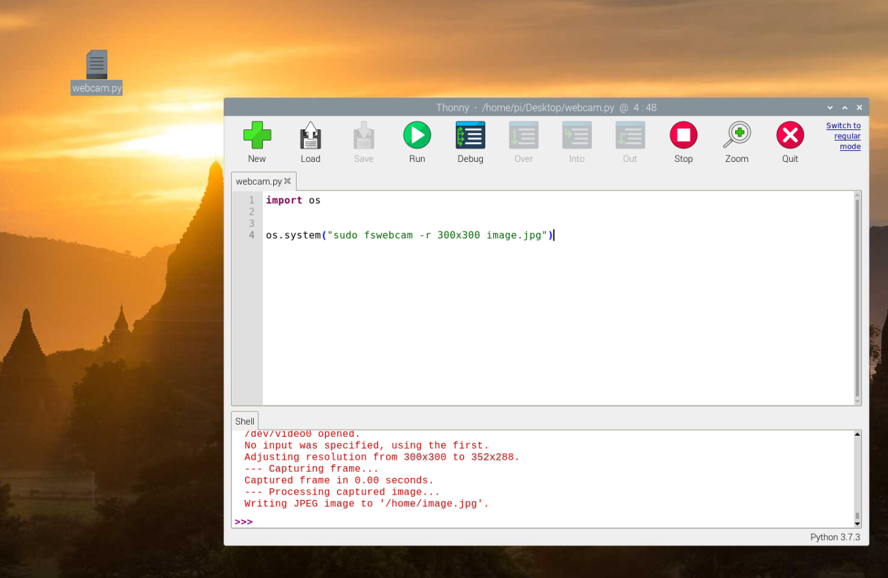

## 1. 執行 lsusb -v 指令，觀察系統顯示的 usb 裝置，透過 grep “14 Video” 指令篩選顯示的結果，了解 webcam 裝置在系統層次支援的狀態。
---

## 2. 安裝 fswebcam，執行 fswebcam 拍一張照片，確定 webcam 動作正常，並且透過更改參數與設定參數檔案的方式，執行 fswebcam，確定可以產生隨時間依序儲存的檔案。
---

## 3. 透過 python 呼叫 fswebcam，觀察 python 呼叫 fswebcam 執行外部參數的方式，並且練習更改 fswebcam 的參數檔案，不更動 python 程式碼的方式，儲存各種類型的拍照結果。
---
